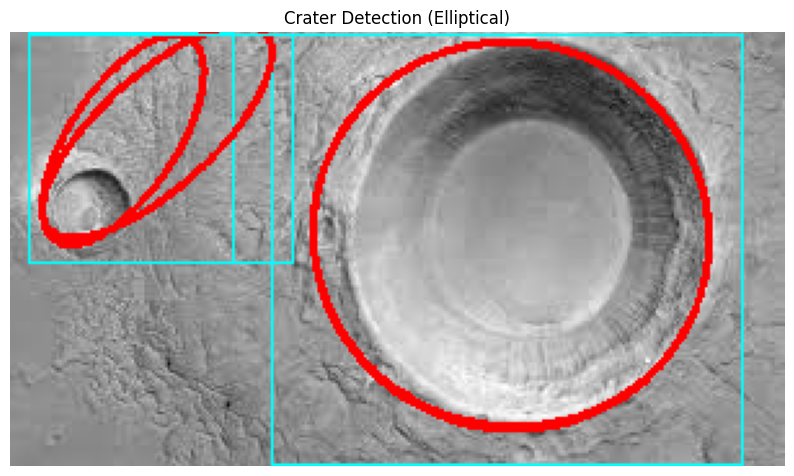
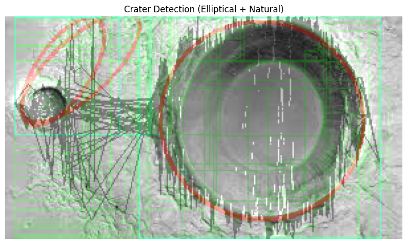
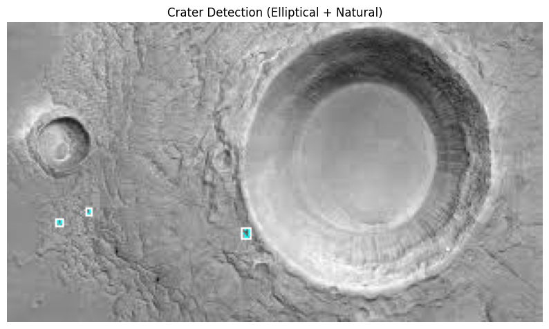

# Crater Detection Pipeline using Texture and Shape Analysis

This project implements a robust pipeline for detecting craters in grayscale planetary or satellite imagery using a combination of texture-based region segmentation, edge detection, morphological analysis, and ellipse fitting.

## 📺 Demo

[](https://www.youtube.com/watch?v=fIbqoxuKyAw)

##  Overview

The pipeline performs the following steps:
1. **Texture-Based ROI Segmentation** using GLCM (Gray-Level Co-occurrence Matrix) features and KMeans clustering.
2. **Edge Detection** using Sobel filters.
3. **Edge Segmentation** and contour extraction.
4. **Graph Construction** from valid edge segment pairs based on geometric criteria.
5. **Crater Cycle Detection** using graph cycles.
6. **Ellipse Fitting & Validation** using a fitness score.
7. **Natural Crater Detection** based on compactness of contours.
8. **Smooth Arc Drawing** using spline fitting for aesthetic visualization.

##  Dependencies

Make sure the following libraries are installed:

```bash
pip install opencv-python-headless cupy-cuda12x scikit-image matplotlib networkx scipy scikit-learn
```

> **Note:** `cupy` requires a CUDA-capable GPU and appropriate CUDA installation (`cupy-cuda12x` for CUDA 12.x).


##  Key Functions

- `compute_glcm_features`: Extracts texture features using GLCM.
- `generate_roi_from_texture`: Segments the image based on texture into ROIs.
- `edge_detection`: Computes gradient magnitude and angle using Sobel filters.
- `extract_edge_segments`: Extracts meaningful contours from edge map.
- `build_edge_graph`: Constructs a graph from edge segments based on spatial and angular similarity.
- `extract_graph_cycles`: Detects cycles in the graph, potentially outlining crater-like structures.
- `visualize_ellipses_on_cycles`: Fits ellipses on graph cycles and evaluates them using a fitness score.
- `detect_and_draw_natural_craters`: Identifies natural craters using compactness criteria.
- `draw_smooth_arc_from_cycle`: Draws smooth arcs along valid crater cycles.

##  Usage

Place your grayscale crater image inside the `images/` folder and update the image path in the script:

```python
image = cv2.imread("/content/images (2).jpeg", cv2.IMREAD_GRAYSCALE)
image = cp.asarray(image)
result, f1, f2, f3 = run_crater_detection_pipeline(image)
```

Visualize the output:

```python
plt.figure(figsize=(10, 10))
plt.imshow(result[..., ::-1])
plt.title("Crater Detection (Elliptical + Natural)")
plt.axis("off")
plt.show()
```

##  Output

The final output combines:
- **Red Ellipses**: Elliptically detected craters.
- **Yellow/Green Contours**: Naturally shaped craters.
- **Cyan Arcs**: Smooth arcs derived from crater boundaries.

##  Notes

- Adjust thresholds (e.g., fitness, compactness) in the script for tuning detection sensitivity.

##  Example Result

  
  
  
> Example result showing detected craters using multiple techniques.

##  Author

**Developed by:** *Lovy Verma (12140990)*
